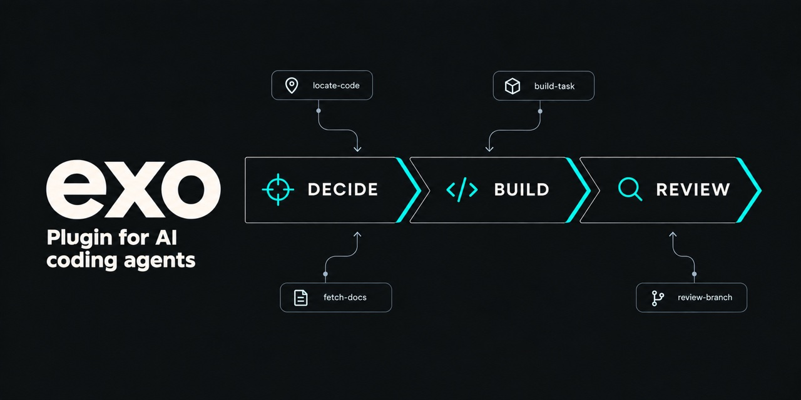

<p align="center">
  
</p>

# exo

[](https://github.com/blauwtje/exo/actions/workflows/quality.yml)

exo is a Claude Code plugin that gives Claude one way of working: decide what to build, build it and review it, each as its own step. It is built for the ways a long session goes wrong: code nobody asked for, whole files read to find one function, and a context so full that earlier decisions drop out of it.

## Install

```text
/plugin marketplace add blauwtje/exo
/plugin install exo@blauwtje
```

Restart Claude Code afterwards. The session hook needs `bash` and `node` on `PATH`.

On Windows, exo needs Git for Windows, whose Git Bash runs the hooks, and Node on `PATH`. Windows support is best effort: the checks run on Linux only, with no Windows run, and Windows bugs are fixed as they are reported.

exo needs a subagent spawn depth of at least 2 in `~/.claude/settings.json`; Claude Code 2.1.219 and later default to 3, so this entry only matters on 2.1.217, 2.1.218, or wherever something has set a lower value:

```json
{
  "env": {
    "CLAUDE_CODE_MAX_SUBAGENT_SPAWN_DEPTH": "2"
  }
}
```

`build` dispatches a `run-unit` agent that dispatches `exo:build-task` agents, so a subagent must be able to spawn subagents of its own ([subagents](https://code.claude.com/docs/en/sub-agents#let-subagents-spawn-their-own-subagents)).

## Check that it works

Start a new session and run:

```text
/exo:configure
```

It shows every setting with its layer. In a clone of this repository, `npm run check` runs every check.

## How exo works

- **Stages.** `/exo:start` shows the skills or picks one for a stated goal. A feature then runs through three stages in order: `spec` decides what "done" means when that is still open, `build` runs the plan or a decided change test-first, and `verify` runs the gate, the branch review and the repair before a pull request. A reported failure is diagnosed before anything is fixed. Each stage ends by asking which stage runs next and on which model.
- **Helpers.** Searches, builds and reviews run in a helper: a separate Claude context with its own instructions and a named model, so its file dumps never reach your session. Code search runs in the `exo:locate-code` agent, the discovery of a redesign in `exo:survey-ui`, the final branch review in `exo:review-branch` for a branch of at most five changed files and 200 changed lines and in `exo:review-branch-deep` above that, the post-build design critique in `exo:critique-ui`, and documentation research in `exo:fetch-docs` with web and read tools only. These and the other agents live under `agents/`; `lib/model-kinds.json` sets each one's model and effort.
- **The ladder.** Before every edit that adds code, Claude checks whether the code is needed and whether something already does it; the ladder below links to the checks.
- **The read guard.** A hook on `Read` refuses to read a file of over 400 lines in one go (the default; `/exo:configure guard_lines 800` raises it, and `guards` set to `off` stands every guard down), and refuses to read lines again that have not changed since the last read. It hooks `Read` only: file content read through Bash, as `cat` or `sed` reads it, is neither refused nor counted.
- **The reply levels and the scannable style.** The `replies` setting sets how many words a reply uses; the `exo:scannable` output style sets how a reply is laid out. Both are described below.
- **The guards.** One hook on `Bash` runs every guard and refuses a destructive command, a shell read of a protected secret and a commit that names an AI as its author, each with a reason that says what to do instead.

A session hook loads these rules at startup, resume, clear and compaction, so they hold without calling a skill.

## Reply levels

`replies` sets how dense the words of a chat reply are:

| Level | What it drops |
|---|---|
| `standard` | Nothing: full prose. |
| `tight` (default) | Preamble, recap, filler and hedging. |
| `terse` | The same, and the words a, an, the, is, are, was and were; fragments, `→` and `=` are fine. |

Switch it with `/exo:configure replies terse` (or `tight`, `standard`), or in the plugin options in `/config`; `.claude/exo.json` sets it for one repository and `.claude/exo.local.json` for one machine. The rule names what to cut, not English grammar, so `terse` works in any language you write in. Because a session rule fades over a long chat and after compaction, `terse` also adds a one-line reminder of about 45 tokens to every prompt you send; `tight` and `standard` add nothing.

What every level keeps whole: code, commands, paths, identifiers, error text, numbers and every not, no, only and except. Full sentences return for a security warning and a confirmation before an irreversible action, and at `terse` also for a question to you. Only chat prose is shortened: commit, pull request and changelog text, docs, code comments and saved files keep normal prose.

At `terse`, exo also scores each reply after it ends. A reply of 25 chat words or more that runs over 2.0 articles (a, an, the) per 100 words earns a short note on your next prompt: it names the score, lists the stray article phrases and shows one of the reply's own sentences with its articles removed, so the model tightens the following reply. The check never blocks or rewrites a reply, skips a reply that ends in a question and the reply to a lone `?`, and does nothing at `tight` or `standard`.

At `terse`, a display filter also removes the articles that slip through before you read them. Its `MessageDisplay` hook rewrites each streamed chat line and leaves fenced and inline code, quoted text, URLs, paths and file names, blockquotes, table rows and a closing question that asks you something as written. The filter changes only what the screen shows: the transcript, the model's context and the score check keep the original reply, so the score still measures what the model wrote.

To turn it off, set `replies` to `standard`.

## The scannable style

`exo:scannable` is an output style for a reader who scans: the answer comes first in one sentence, the reply has at most three labelled blocks and at most eight lines above one closing line, and that line holds the single next action. It is opt-in; exo never selects it. Switch it on with `/output-style` and pick `exo:scannable`, or set `"outputStyle": "exo:scannable"` in your own settings.

It keeps whole: a warning before an irreversible or security-relevant action, a failed or unrun check, every not, no, only and except, code, diffs and exact error output. When a reply is too long it cuts whole points from the bottom of a fixed order, starting with what only informs you, and the closing line may offer what it cut.

The style sets the layout and `replies` sets the word density; both apply and neither outranks the other. To turn it off, pick another style in `/output-style`.

## The guards

A guard is a `PreToolUse` hook that refuses a call before it runs and tells Claude why. It never rewrites a command. Every guard is on by default:

| Guard | Refuses |
|---|---|
| Output | A known-verbose build, test or log command that prints all its output, and a whole-file shell read over the byte cap; the reason gives the bounded form. |
| Detach | A process launched with `&`, `nohup`, `disown` or `setsid`, which outlives the session; use the Bash tool's `run_in_background`. |
| Destructive | A command that deletes a container, volume, database or credential. |
| Git | A force push, `reset --hard`, `clean -f`, a force-delete of a branch with unlanded commits, a stash drop or clear, and a checkout or restore of the whole tree. |
| Secrets | A shell read of a path your `Read(...)` deny entries protect. |
| Writing | AI attribution in a commit message, pull request text or new branch name, and a commit subject that is not a Conventional Commit. |

Each guard matches the words that run, so a word inside a commit message or a heredoc body refuses nothing. The command string is matched, not parsed, so a command assembled from variables at run time reads as written. A guard that hits a fault lets the call through.

To turn them all off, run `/exo:configure guards off`; `.claude/exo.json` does it for one repository. There is no switch for a single guard.

## Skills

Every skill is invoked as `/exo:<name>`. Don't remember a name? Type `/exo:start`, or `/exo:start <goal>`, and it shows this list in plain words or picks one for you. The first group below Claude may also start on its own when its trigger matches; the rest run only when you type them.

### Model-invoked

| Skill | What it does | Just say |
|---|---|---|
| `spec <outcome>` | Decides what "done" means, when that is still open: the result, the data, the architecture. | "I want something for X but I'm not sure what exactly" |
| `build [plan]` | Runs a plan file, with helpers and review, or with no plan file, builds a decided change test-first where it can. | "run the plan at docs/...", or after `/clear`: "carry on", or "build X", "fix this bug, here's how to reproduce it" |
| `verify [plan]` | Runs the gate before a pull request: the scripted checks, the branch review and repairing what it finds. | "verify this branch", "is this ready to ship?" |
| `ship [numbers]` | Pushes, opens or merges a pull request, fixes its checks or review comments. | "push this", "merge the PR", "fix the checks" |
| `find-cause <symptom>` | Finds the real cause of a failure before fixing it. | "this doesn't work", "why does X crash?" |
| `design-ui <surface>` | Designs or improves how a screen looks. | "make this page nicer", "new component" |
| `file-issues <scope>` | Files GitHub issues. | "turn this into issues" |
| `refactor <the refactor to run>` | Restructures code without changing its behavior. | "rename X", "move Y", "split this module" |
| `edit-skills <skill>` | Writes or improves a skill or agent. | "fix skill X", "make an agent that ..." |
| `write-docs <the document or text to write or edit>` | Writes a README, docs page, PR or commit text. | "write the README", "PR description" |
| `configure [key value scope]` | Shows or changes an exo setting. | "set replies to standard" |

### User-invoked

These carry `disable-model-invocation: true`, so Claude never starts one itself: `start` shows the skills when you ask, and `save-session` and `remember` write a record only you should approve. The flag also keeps `route-skills` for you to start.

| Skill | What it does | Just say |
|---|---|---|
| `start [goal]` | Shows this list, or picks the one skill for a stated goal. | Type `/exo:start` when no skill name comes to mind |
| `save-session` | Saves where a session is, for a fresh one after `/clear`. | Type `/exo:save-session`, then `/clear` |
| `remember` | Books a correction about this repository, or approves a claim two sessions have booked. | Type `/exo:remember` |

### Rarely needed

Skills for a case most sessions never hit; still worth knowing about.

| Skill | What it does | Just say |
|---|---|---|
| `check-docs <library, version, question>` | Checks how a pinned library, API or service actually behaves. | "does this still hold for version X of Y?" |

`route-skills` holds the routing rules every other skill follows. The session hook injects it at every start, resume, clear and compaction, so it is never picked; type `/exo:route-skills` to read it.

Each skill also has a page under `docs/skills/`, written for a person: what the skill is for and what it leaves behind, without the instruction the model reads.

A new skill needs all of: the folder at `skills/<name>/`, the name joining `EXPECTED_SKILLS` in `verify/budgets.mjs`, a reference contract in `verify/checks/reference-tables.mjs`, its description paid for in the description budgets, and a page under `docs/skills/`.

## The ladder

`skills/route-skills/references/ladder.md` holds the ladder Claude takes before every edit that adds or replaces code: the rungs, the tie-break between them, and what is never shortened on any rung.

## Settings

exo reads each setting from four layers, highest first: `.claude/exo.local.json` (this machine, git-ignored), `.claude/exo.json` (the repository, committed so every collaborator shares it), the plugin's global options, then the default. The global options are asked when the plugin is enabled and change later in `/config`; `/exo:configure` shows every value with its layer and writes the two repository files.

| Key | Values | Default | Effect |
|---|---|---|---|
| `specs` | `docs`, `issues`, `both` | `docs` | Where `spec` stores a spec: `docs/specs/`, a GitHub issue marked as shaped, or both. Without git, a GitHub remote or a signed-in `gh`, it writes the file. |
| `replies` | `terse`, `tight`, `standard` | `tight` | How dense replies are. `terse` also drops articles and linking verbs; `tight` drops preamble, recap and filler; `standard` writes full prose. All three keep code, paths, errors and warnings whole. See [Reply levels](#reply-levels). |
| `ship` | `ask`, `pr-merge`, `open-pr`, `push`, `local` | `ask` | The finish route `ship` takes without asking. `ask` puts the question, but still pushes a non-default branch to origin first; the other values run that route when it can. |
| `workspace` | `ask`, `branch`, `worktree`, `current` | `ask` | Where a code-changing run commits without asking: `ask` puts the question; `branch` makes a new branch, `worktree` a new worktree beside the checkout, and `current` commits on the branch already checked out. |
| `guards` | `on`, `off` | `on` | Whether the safety guards refuse the commands and edits they cover. `off` switches all of them off. See [The guards](#the-guards). |
| `guard_lines` | whole number of lines | `400` | From how many lines the read guard refuses a whole-file `Read`: a longer file is read in a located range. |
| `heavy_commands` | command prefixes joined by `;` | empty (off) | A Bash command that starts with a listed prefix runs once per code state across all sessions: a second session waits for the first and takes its result, and a green run holds 24 hours. `EXO_HEAVY_FORCE=1 <command>` forces a run. |
| `heavy_after_seconds` | whole number of seconds, `0` off | `60` | A test-like Bash command (its program or script name contains `test`, `e2e`, `check`, `lint` or `verify`; a path, URL or later argument does not count) whose last run in the project took longer counts as heavy and runs through the `heavy_commands` dedupe with nothing listed; watch, UI and headed runs (`--watch`, `--ui`, `--headed`), `dev`, `serve` and `start` runs, installs, deploys, builds, forced runs (`EXO_HEAVY_FORCE`), wait loops (`until`, `while`, `sleep`) and commands that read remote state (`gh`, `curl`, `ssh`, `git`, `docker`, …) are never learned. |
| `budget` | `high`, `medium`, `low` | `medium` | Which model each agent runs on. The old names `full`, `normal` and `lean` still read as `high`, `medium` and `low`. `high` is `medium` with the deep branch review, the design critique and the hardest work dispatched as their `xhigh` twins, `exo:review-branch-deep-high`, `exo:critique-ui-high` and `exo:solve-hard-high`. `medium` uses each agent's own model. `low` dispatches an agent whose tier is listed under `budgets` in `lib/model-kinds.json` on that tier's replacement tier instead; today `strong` becomes `standard`, except the hardest work, which `exo:solve-hard-low` keeps on the strong tier at `medium` effort. |

## Develop

```bash
npm install
npm run check            # the gate before any commit: verifier, self-test and script tests
claude --plugin-dir .    # run the working tree instead of the installed copy
```

`CONTRIBUTING.md` covers the checks, how skills hand work to helpers, the hooks and the guards. `benchmarks/README.md` covers the paired runs that measure exo against a session without it.

A change lands under `## Unreleased` in `CHANGELOG.md` without a version change, so the installed plugin updates only on a release. `CLAUDE.md` lists the release steps.

## License

[MIT](LICENSE): use it, change it and share it for any purpose, commercial included.
